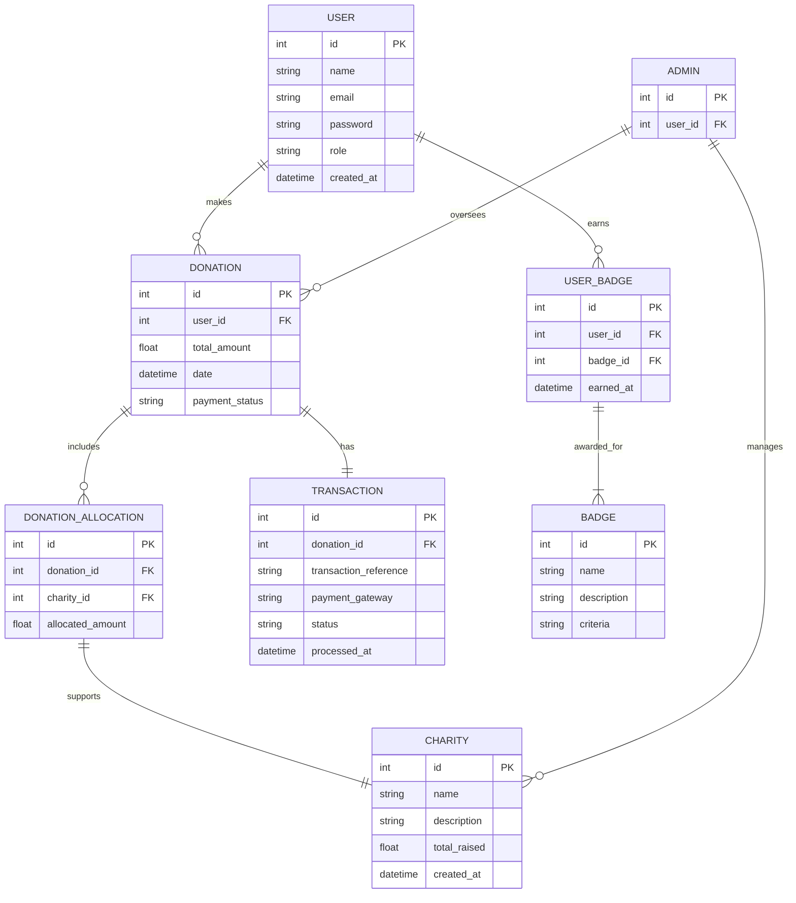

### **📊 Entity-Relationship Diagram**

```mermaid

erDiagram
    USER {
        int id PK
        string name
        string email
        string password
        string role
        datetime created_at
    }
    CHARITY {
        int id PK
        string name
        string description
        float total_raised
        datetime created_at
    }
    DONATION {
        int id PK
        int user_id FK
        float total_amount
        datetime date
        string payment_status
    }
    DONATION_ALLOCATION {
        int id PK
        int donation_id FK
        int charity_id FK
        float allocated_amount
    }
    TRANSACTION {
        int id PK
        int donation_id FK
        string transaction_reference
        string payment_gateway
        string status
        datetime processed_at
    }
    BADGE {
        int id PK
        string name
        string description
        string criteria
    }
    USER_BADGE {
        int id PK
        int user_id FK
        int badge_id FK
        datetime earned_at
    }
    ADMIN {
        int id PK
        int user_id FK
    }

    USER ||--o{ DONATION : makes
    DONATION ||--o{ DONATION_ALLOCATION : includes
    DONATION_ALLOCATION ||--|| CHARITY : supports
    DONATION ||--|| TRANSACTION : has
    USER ||--o{ USER_BADGE : earns
    USER_BADGE ||--|{ BADGE : awarded_for
    ADMIN ||--o{ CHARITY : manages
    ADMIN ||--o{ DONATION : oversees

```

---