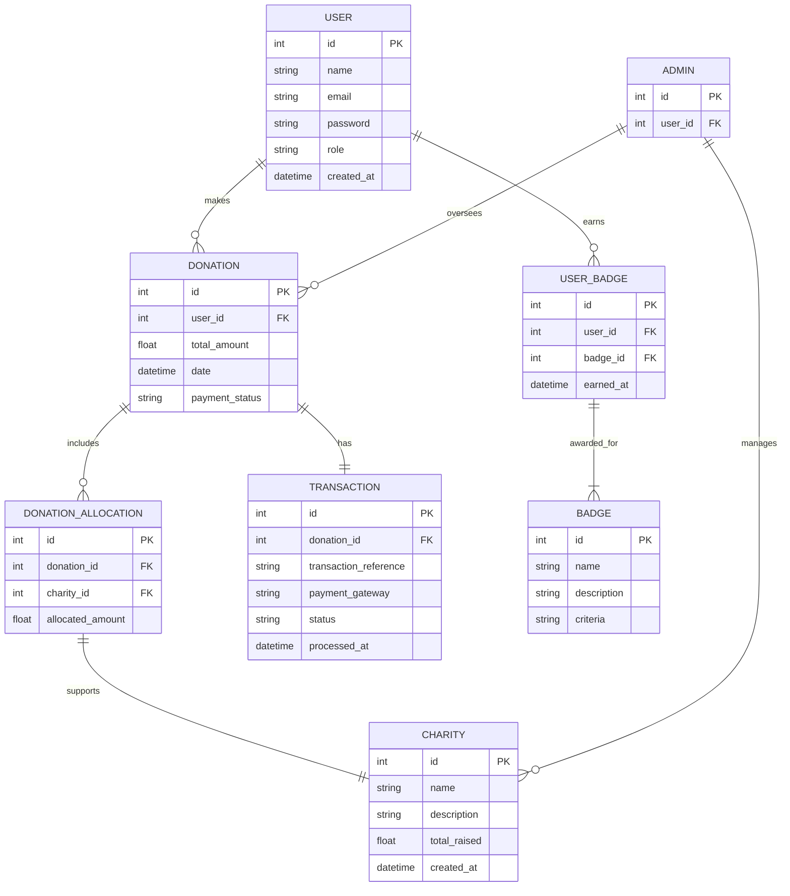
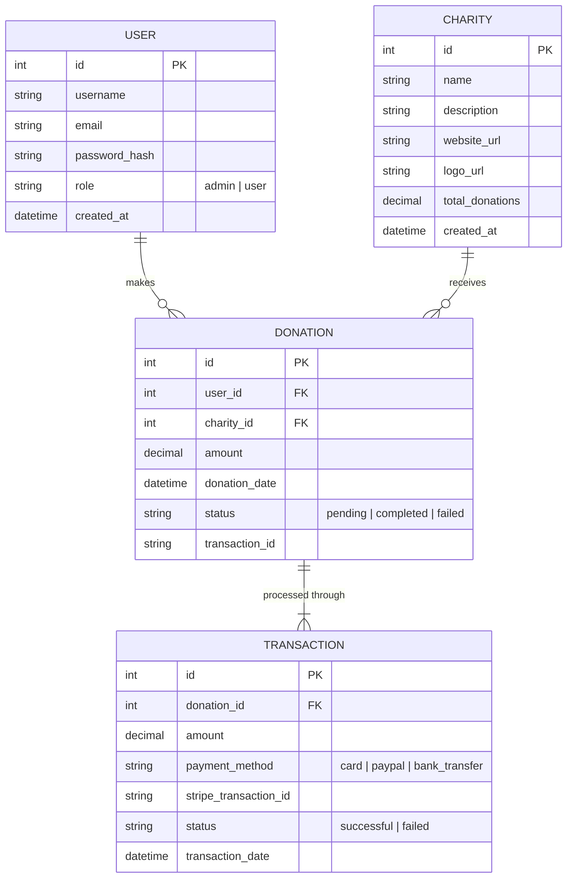

### **📊 Entity-Relationship Diagram**



---





### **📌 Website Flow & Wireframe (Text-Based)**  

#### **1. Home Page**  
```
+------------------------------------------------------+
|   Wedding Charity Donation Platform                 |
|------------------------------------------------------|
|  [ Hero Section: Why donate instead of gifts? ]     |
|  [ Call to Action: "Make a Donation" ]              |
|  [ Stats: Total Donations | Messages | Charities ]  |
|  [ Button: View Supported Charities ]               |
|  [ Login | Register (if not logged in) ]            |
+------------------------------------------------------+

Links to:
  - [Make a Donation] → (Donation Page)
  - [View Charities] → (Charities Page)
  - [Login/Register] → (Auth Pages)
  - [Admin Dashboard (if logged in as admin)] → (Admin Panel)
```

---

#### **2. Login Page**
```
+------------------------------------------------------+
|   Login to Your Account                             |
|------------------------------------------------------|
|  [ Email ]                                          |
|  [ Password ]                                       |
|  [ Login Button ]                                   |
|  [ Forgot Password? ]                               |
|  [ No account? Register Here ]                      |
+------------------------------------------------------+

After successful login:
  - Redirects to → (Home Page)  
  - If admin → Redirects to (Admin Dashboard)
```

---

#### **3. Register Page**
```
+------------------------------------------------------+
|   Create an Account                                 |
|------------------------------------------------------|
|  [ Name ]                                           |
|  [ Email ]                                          |
|  [ Password ]                                       |
|  [ Confirm Password ]                               |
|  [ Register Button ]                                |
|  [ Already have an account? Login Here ]           |
+------------------------------------------------------+

After successful registration:
  - Redirects to → (Home Page)
```

---

#### **4. Donation Page**  
```
+------------------------------------------------------+
|   Make a Donation                                   |
|------------------------------------------------------|
|  [ Name (Optional) ]                                |
|  [ Amount ($/€ selection) ]                         |
|  [ Message to the Couple ]                          |
|  [ Payment Instructions (Manual Bank Transfer) ]    |
|  [ Submit Donation Button ]                         |
+------------------------------------------------------+

After submission:
  - Redirects to → (Thank You Page)
```

---

#### **5. Thank You / Confirmation Page**  
```
+------------------------------------------------------+
|   Thank You for Your Donation!                      |
|------------------------------------------------------|
|  [ Display Message Left for the Couple ]            |
|  [ Option: Share on Social Media ]                  |
|  [ Return Home Button ]                             |
+------------------------------------------------------+

Links to:
  - [Home Page] → (Back to main)
  - [View Charities] → (Explore more)
```

---

#### **6. Charities Page**  
```
+------------------------------------------------------+
|   Supported Charities                               |
|------------------------------------------------------|
|  [ Charity 1 | Logo | Brief Impact Statement ]      |
|  [ Charity 2 | Logo | Brief Impact Statement ]      |
|  [ Charity 3 | Logo | Brief Impact Statement ]      |
+------------------------------------------------------+

Links to:
  - [Make a Donation] → (Back to Donation Page)
  - [Home] → (Return to Main Page)
```

---

#### **7. Admin Dashboard (Private - Restricted Access)**  
```
+------------------------------------------------------+
|   Admin Panel (Restricted)                          |
|------------------------------------------------------|
|  [ View All Donations ]                             |
|  [ Confirm Donations (Mark as Received) ]          |
|  [ Manage Charities (Add/Edit/Delete) ]            |
|  [ View Stats: Total Donations, Top Contributors ]  |
+------------------------------------------------------+

Accessible only with login.
```

---

### **🌐 Page Connections Summary**
```
[ Home ] → [ Login/Register ] → [ Home (Logged In) ]  
[ Home ] → [ Donation Page ] → [ Thank You Page ]  
[ Home ] → [ Charities Page ]  
[ Home ] → [ Admin Dashboard (if Admin) ]  
```

This keeps the flow simple and **prioritizes essential features** while allowing future expansion (such as Stripe, JWT, etc.).
