# **📅 Project Planning Schedule**

---

## **🟢 Phase 1: Project Setup & Planning**
✅ **Jan 30 – Feb 2**
- Finalize **ER Diagram** & database schema.  
- Write **User Stories** & define key functionalities.  
- Set up **GitHub repo** (with proper branching strategy).

✅ **Feb 3 – Feb 9**
- Implement **JWT authentication & user registration**.  
- Set up **Django security settings** (HTTPS, CSRF, CORS).  
- Create **React project structure**.  

---

## **🟡 Phase 2: Core Features & API Development**
✅ **Feb 10 – Feb 16**
- Develop **Charity & Donation models** in Django.  
- Implement **Donation Allocation logic** (50% split to charities).  
- Build & test **Django REST API for donations**. 

✅ **Feb 17 – Feb 23**
- Integrate **React frontend with API (Axios, SWR, or React Query)**.  
- Develop **User Dashboard** (show donations, supported charities).  
- Implement **Stripe/PayPal payment integration**.  

✅ **Feb 24 – March 2**
- Implement **Admin Dashboard** (manage charities & track donations).  
- Add **role-based access control (RBAC)** for Admin & Users.  
- Start **unit testing (Django + React Jest/Testing Library)**.  

---

## **🟠 Phase 3: Enhancements & Security Hardening**
✅ **March 3 – March 9**
- Implement **Gamification Features (Badges for Donors)**.  
- Add **social sharing for charities & donations**.  
- Optimize **API security & rate limiting**.  

✅ **March 10 – March 16**
- Finalize **responsive UI & mobile optimizations**.  
- Implement **error handling & logging**.  
- Improve **UX (animations, tooltips, form validation, etc.)**.  

✅ **March 17 – March 23**
- Complete **automated testing (backend + frontend)**.  
- Set up **audit logs for transactions & user actions**.  
- Perform **API load testing & performance optimization**.  

---

## **🔴 Phase 4: Deployment, Bug Fixes & Final Presentation**
✅ **March 24 – March 30**
- Deploy **final version to Render.com**.  
- Test **real Stripe/PayPal transactions**.  
- Write **project documentation** (README, API docs).  

✅ **March 31 – April 6**
- Fix **bugs & improve final UI**.  
- Add **final touches to the user experience**.  
- Prepare **presentation slides & demo script**.  

✅ **April 7 – April 12**
- **Final testing & security review**.  
- **Run deployment checklist** (SEO, backups, SSL, DNS settings).  
- **Record a demo video** (for backup).

---

### **📊 Entity-Relationship Diagram**

```mermaid

erDiagram
    USER {
        int id PK
        string name
        string email
        string password
        string role
        datetime created_at
    }
    CHARITY {
        int id PK
        string name
        string description
        float total_raised
        datetime created_at
    }
    DONATION {
        int id PK
        int user_id FK
        float total_amount
        datetime date
        string payment_status
    }
    DONATION_ALLOCATION {
        int id PK
        int donation_id FK
        int charity_id FK
        float allocated_amount
    }
    TRANSACTION {
        int id PK
        int donation_id FK
        string transaction_reference
        string payment_gateway
        string status
        datetime processed_at
    }
    BADGE {
        int id PK
        string name
        string description
        string criteria
    }
    USER_BADGE {
        int id PK
        int user_id FK
        int badge_id FK
        datetime earned_at
    }
    ADMIN {
        int id PK
        int user_id FK
    }

    USER ||--o{ DONATION : makes
    DONATION ||--o{ DONATION_ALLOCATION : includes
    DONATION_ALLOCATION ||--|| CHARITY : supports
    DONATION ||--|| TRANSACTION : has
    USER ||--o{ USER_BADGE : earns
    USER_BADGE ||--|{ BADGE : awarded_for
    ADMIN ||--o{ CHARITY : manages
    ADMIN ||--o{ DONATION : oversees

```

---

### **👤 User Stories**

#### **As a guest, I want to:**  
- View the homepage with information about the cause.  
- Browse charity profiles without logging in.  
- Register for an account to track my donations.  

#### **As a registered user, I want to:**  
- Log in and access a personalized dashboard.  
- Browse charity profiles and read more details.  
- Donate to a charity using an integrated payment method.  
- View my donation history and total amount donated.  
- Earn badges based on my donation milestones.  
- Share charities on social media to spread awareness.  

#### **As an admin, I want to:**  
- Manage users (approve, suspend, or delete accounts).  
- Add, update, or delete charity organizations.  
- View total donations and generate reports.  
